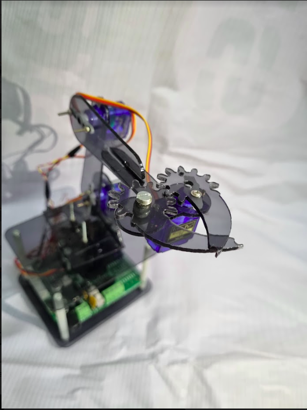
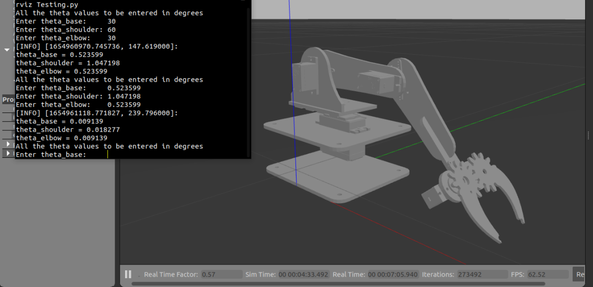

# MARIO WORKSHOP 2.2
*MARIO* abbreviation for *Manipulator on ROS Based Input Output* is a bot with 3 Degree of Freedom. It consists of two SG90 micro servo and one MG995 metal gear servo motor. The servo motors are placed on base, elbow and shoulder enabling it with 3 Degrees of Freedom.

## Sneek Peek 

### Working of the Mario Bot

### Mario bot simulated using Gazebo 

## File Structure 
    ├── 1_chatter_listener            # talker and listener script to understand the nodes and communications in ROS
    ├── 2_simulation_dh               # simulation of DH paramteres
    ├── 3_simulation_rviz             # simulation of MARIO bot on rviz
    ├── 4_simulation_gazebo           # simulation of MARIO bot on gazebo
    ├── assets                        # contains necessary gifs, images 
    ├── firmware                      # contains ESP-IDF examples for controlling servo motors and rosserial
    │   ├── 1_servo_set_zero          # example in ESP-IDF to set angles of all servo motor zero
    │   ├── 2_servo_sweep             # example in ESP-IDF to set variable angles in servo motor
    │   ├── 3_rosserial_rviz          # example in ESP-IDF to interface with rviz environment as well as ESP32
    │   ├── 4_rosserial_gazebo        # example in ESP-IDF to interface with gazebo environment as well as ESP32
    │   ├── 5_servo_test_webserver    # example in ESP-IDF to set angles of servo over the webserver interface
    │   └── components                # contains all the dependencies required for the above examples
    │       ├── rosserial_esp32       # rosserial library to setup interface between ros environment and ESP32
    │       └── sra-board-component   # library to interface with SRA board
    ├── LICENSE
    └── README.md 

## Kinematics
* Mario workshop aims to provide the basic knowledge about the DH parameters, forward kinematics , inverse kinematics.
  * DH Parameters :- Denavit–Hartenberg parameters (also called DH parameters) are the four parameters associated with a particular convention for attaching reference frames to the links of a spatial kinematic chain, or robot manipulator
  * Forward Kinematics :- Forward kinematics refers to the use of the kinematic equations of a robot to compute the position of the end-effector from specified values for the joint parameters. The kinematics equations of the robot are used in robotics, computer games, and animation.
  * Inverse Kinematics :- inverse kinematics is the mathematical process of calculating the variable joint parameters needed to place the end of a kinematic chain, such as a robot manipulator or animation character's skeleton, in a given position and orientation relative to the start of the chain.
## ROS 
ROS is an open-source, meta-operating system for your robot. It provides the services you would expect from an operating system, 
including hardware abstraction, low-level device control, implementation of commonly-used functionality, message-passing between processes,
and package management.

## Publisher and Subscriber
Publish/Subscribe is a messaging pattern that aims to decouple the sending (Publisher) and receiving (Subscriber) party. A real world example could be a sport mobile app that shows you up-to-date information of a particular football game you're interested in. In this case you are the subscriber, as you express interest in this specific game. On the other side sits the publisher, which is an online reporter that feeds a system with the actual match data.
This system, which is often referred as the message broker brings the two parties together by sending the new data to all interested subscribers.

While ROS works on the same system, this system is also used in various other libraries like MQTT.

## ESPIDF
ESP-IDF is the development framework for Espressif SoCs.The [SRA Board](https://github.com/SRA-VJTI/sra-board-hardware-design) uses ESP32 as microcontroller, hence ESPIDF is required
to code the ESP32. Examples included inside firmware directory has been written in ESPIDF version 4.2 .

## ROSSERIAL
ROS Serial is a point-to-point version of ROS communications over serial, primarily for integrating low-cost microcontrollers (Arduino) into ROS. 
ROS serial consists of a general p2p protocol, libraries for use with Arduino, and nodes for the PC/Tablet side (currently in both Python and Java).

